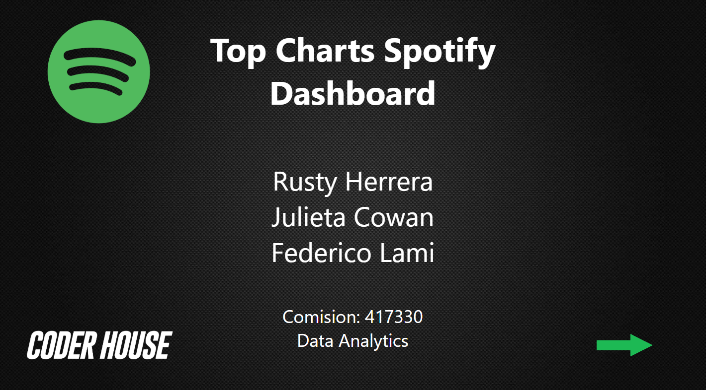

# Spotify Top Charts Dashboard (2017 - 2019)

Dashboard interactivo en **Power BI** que analiza las tendencias musicales en Spotify entre 2017 y 2019.  
El objetivo es identificar los géneros, artistas y colaboraciones más relevantes del mercado musical en ese período.

---

## 📊 Vistas del Dashboard

### 📌 Portada

---

### 📌 Panel de control

---

### 📌 Estudio general

- Ranking de artistas más populares.  
- Número de hits y semanas promedio en charts.  

---

### 📌 Estudio de mercado colaborativo

- Número de colaboraciones por artista.  
- Followers alcanzados gracias a dichas colaboraciones.  

---

### 📌 Mercado general

- Streams anuales.  
- Seguidores por género musical.  

---

### 📌 Tendencias de mercado colaborativo

- Número de hits por combinaciones de géneros.  
- Variación de streams promedio entre 2017-2018 y 2018-2019.  

---

## 🚀 Tecnologías utilizadas
- **Power BI** → Creación del dashboard.  
- **Spotify Charts Dataset (2017-2019)** → Fuente de datos.  

---

## 👨‍💻 Autores
- Rusty Herrera  
- Julieta Cowan  
- Federico Lami  

---

📌 *Proyecto académico desarrollado en el curso de Data Analytics (Coderhouse).*  
